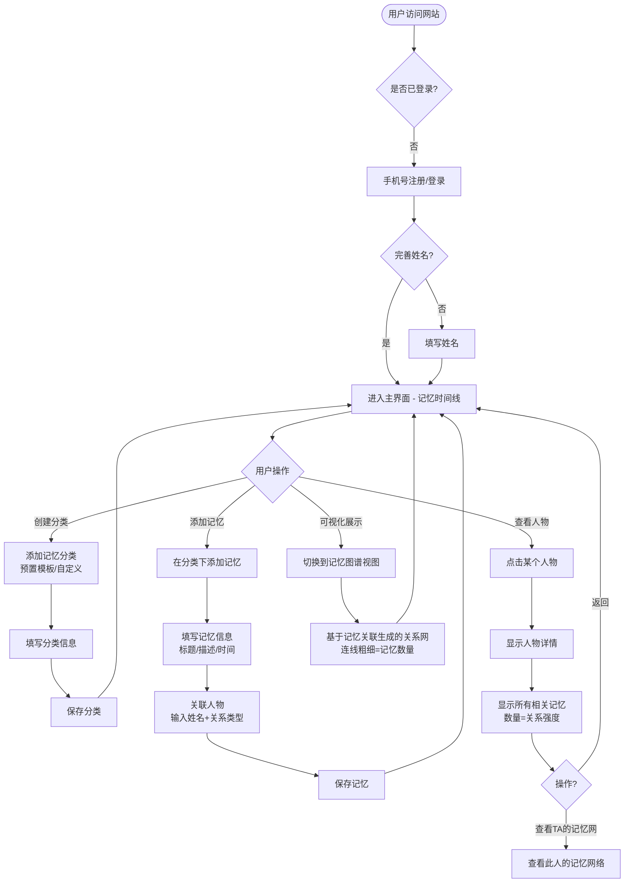
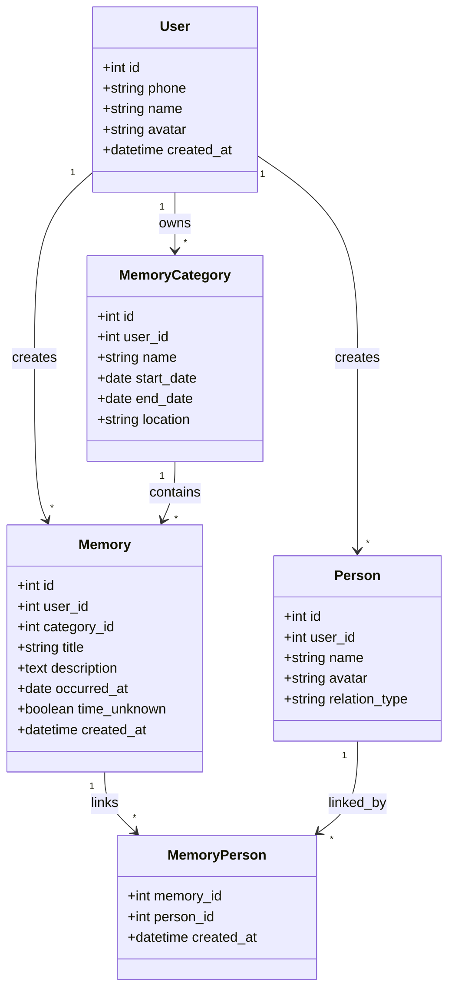

# PRD-001: 关系网 - 全球人际关系记忆平台

| 项目 | 内容 |
|------|------|
| **版本** | v1.0.0 MVP |
| **状态** | 待开发 |
| **创建日期** | 2025-02-13 |
| **产品负责人** | - |

---

## 1. 产品概述

### 1.1 产品愿景

构建一个全球人际关系记忆平台，让每个人都能记录自己的人生记忆，通过记忆中关联的人自然形成人际关系网络。记忆越多，连接越多，关系越近。

### 1.2 核心价值

- **以记忆为中心**：不是"添加好友"，而是通过记录记忆自然沉淀人际关系
- **关系可视化**：用共同记忆的数量衡量关系亲密度，形成可视化的关系图谱
- **人生时间线**：以时间为主线，串联人生的每一个重要时刻

### 1.3 目标用户

- 希望记录人生经历的每一个人
- 希望了解自己人际关系网络的人
- 希望通过记忆连接与他人的关系的用户

---

## 2. 核心业务流程



---

## 3. 用户故事

### US-01: 用户注册/登录

| 项目 | 内容 |
|------|------|
| **优先级** | P0 必须 |
| **用户故事** | 作为一个新用户，我想要通过手机号注册账号并填写姓名，以便登录并开始记录我的记忆时间线 |
| **验收标准** | 1. 手机号必须是11位数字<br>2. 验证码必须是6位数字<br>3. 验证码60秒内限制发送1次<br>4. 验证码错误超过3次需重新获取<br>5. 注册成功后直接进入记忆时间线主界面 |
| **字段定义** | 手机号(11位)、验证码(6位)、姓名(2-20字符) |
| **边界约束** | 手机号格式错误时提示"请输入正确的手机号"；验证码错误时提示"验证码错误或已过期" |

**页面线框图：**

```
┌─────────────────────────────────────────────────────────┐
│                                                         │
│                    ┌───────┐                            │
│                    │ LOGO  │                            │
│                    └───────┘                            │
│                                                         │
│              欢迎来到关系网                               │
│                                                         │
│   ┌─────────────────────────────────────────────┐      │
│   │  📱 请输入手机号                             │      │
│   └─────────────────────────────────────────────┘      │
│                                                         │
│   ┌────────────────────┐  ┌───────────────────┐       │
│   │  🔒 请输入验证码    │  │  获取验证码       │       │
│   └────────────────────┘  └───────────────────┘       │
│                                                         │
│   ┌─────────────────────────────────────────────┐      │
│   │  👤 请输入您的姓名                           │      │
│   └─────────────────────────────────────────────┘      │
│                                                         │
│   ┌─────────────────────────────────────────────┐      │
│   │            开始记录                          │      │
│   └─────────────────────────────────────────────┘      │
│                                                         │
└─────────────────────────────────────────────────────────┘
```

---

### US-02: 记忆时间线主界面

| 项目 | 内容 |
|------|------|
| **优先级** | P0 必须 |
| **用户故事** | 作为一个用户，我登录后想要查看我的记忆时间线，以便浏览我的人生记忆和关联的人，并可以切换垂直/水平视图 |
| **验收标准** | 1. 默认显示垂直时间线视图<br>2. 每个记忆分类卡片显示：分类名称、时间段、地点、记忆数量、关联人物数量<br>3. 支持切换到水平时间线视图<br>4. 点击分类卡片展开/收起该分类下的记忆 |
| **字段定义** | 分类名称、时间段、地点、记忆数量、人物数量 |
| **边界约束** | 空状态提示"暂无记忆，点击添加" |

**垂直视图线框图：**

```
┌─────────────────────────────────────────────────────────────────────┐
│  ≡    关系网                          [🔄]  [⊕添加分类]    👤我的    │
├─────────────────────────────────────────────────────────────────────┤
│                                                                     │
│  ┌─────────────────────────────────────────────────────────────┐    │
│  │  📍 出生                                                   │    │
│  │  📍 北京市 · 1990年                                       │    │
│  │  3个记忆 · 2个人物                                       │    │
│  │  └─ 点击展开                                             │    │
│  └─────────────────────────────────────────────────────────────┘    │
│    ║                                                               │
│    ║                                                               │
│  ┌─────────────────────────────────────────────────────────────┐    │
│  │  📍 XX幼儿园                                                │    │
│  │  📍 北京市 · 1993-1996年                                   │    │
│  │  5个记忆 · 8个人物                                       │    │
│  │  └─ 点击展开                                             │    │
│  └─────────────────────────────────────────────────────────────┘    │
│                                                                     │
│                                          [ + 添加新分类 ]            │
│                                                                     │
└─────────────────────────────────────────────────────────────────────┘
```

**水平视图线框图：**

```
┌─────────────────────────────────────────────────────────────────────┐
│  ≡    关系网                          [🔄]  [⊕添加分类]    👤我的    │
├─────────────────────────────────────────────────────────────────────┤
│                                                                     │
│  出生    幼儿园    小学    中学    大学    工作    现在    未来     │
│   ↓        ↓        ↓       ↓       ↓       ↓       ↓       ↓      │
│  [3]     [5]      [8]     [10]    [12]    [25]    [5]     [2]      │
│  记忆    记忆     记忆    记忆    记忆    记忆    记忆    记忆      │
│                                                                     │
│  ┌─────────────────────────────────────────────────────────────┐    │
│  │  📍 北京大学 (2002-2006)                                  │    │
│  │  · 六一儿童节表演                                        │    │
│  │  · 运动会接力赛                    ←→ 滑动浏览更多       │    │
│  └─────────────────────────────────────────────────────────────┘    │
│                                                                     │
└─────────────────────────────────────────────────────────────────────┘
```

---

### US-03: 创建记忆分类

| 项目 | 内容 |
|------|------|
| **优先级** | P0 必须 |
| **用户故事** | 作为一个用户，我想要创建记忆分类来组织我的记忆，以便更好地管理我的人生时间线 |
| **验收标准** | 1. 支持选择预置模板（出生、幼儿园、小学、中学、大学、硕士、工作、退休等）<br>2. 支持自定义分类名称<br>3. 必须填写开始时间<br>4. 结束时间可选（进行中的分类不填）<br>5. 地点可选填 |
| **字段定义** | 分类名称、开始时间、结束时间、地点 |
| **边界约束** | 开始时间不能晚于结束时间 |

**创建分类弹窗线框图：**

```
┌────────────────────────────────────────────┐
│          创建记忆分类              [×]      │
├────────────────────────────────────────────┤
│                                            │
│  选择预置模板                               │
│  ┌─────┐ ┌─────┐ ┌─────┐ ┌─────┐           │
│  │出生 │ │幼儿园│ │小学 │ │中学 │           │
│  └─────┘ └─────┘ └─────┘ └─────┘           │
│  ┌─────┐ ┌─────┐ ┌─────┐ ┌─────┐           │
│  │大学 │ │硕士 │ │工作 │ │退休 │           │
│  └─────┘ └─────┘ └─────┘ └─────┘           │
│                                            │
│  ──── 或 自定义创建 ────                    │
│                                            │
│  分类名称      [__________________]        │
│  开始时间      [____]年[____]月             │
│  结束时间      [____]年[____]月  ☐进行中    │
│  地点          [__________________]        │
│                                            │
│         [  取消  ]        [  创建  ]        │
└────────────────────────────────────────────┘
```

---

### US-04: 添加记忆

| 项目 | 内容 |
|------|------|
| **优先级** | P0 必须 |
| **用户故事** | 作为一个用户，我想要在某个分类下添加记忆，以便记录发生的事情并关联相关的人 |
| **验收标准** | 1. 必须选择所属分类<br>2. 必须填写记忆标题<br>3. 记忆描述可选<br>4. 发生时间可选填写"时间不详"<br>5. 可以关联多个人物 |
| **字段定义** | 所属分类、标题、描述、发生时间、关联人物 |
| **边界约束** | 标题不能为空 |

**添加记忆弹窗线框图：**

```
┌────────────────────────────────────────────┐
│          添加记忆              [×]         │
├────────────────────────────────────────────┤
│                                            │
│  所属分类：📍 北京大学 (2002-2006)          │
│                                            │
│  记忆标题      [__________________]        │
│                                            │
│  记忆描述                                  │
│  ┌────────────────────────────┐           │
│  │                            │           │
│  │                            │           │
│  └────────────────────────────┘           │
│                                            │
│  发生时间      [____]年[____]月[____]日     │
│                ☐ 时间不详                    │
│                                            │
│  关联人物          [ + 添加人物 ]          │
│  ┌─────┐ ┌─────┐ ┌─────┐                   │
│  │张三 │ │李四×│ │王五×│                   │
│  └─────┘ └─────┘ └─────┘                   │
│                                            │
│         [  取消  ]        [  保存  ]        │
└────────────────────────────────────────────┘
```

---

### US-05: 关联人物

| 项目 | 内容 |
|------|------|
| **优先级** | P0 必须 |
| **用户故事** | 作为一个用户，我想要在记忆中关联人物，以便记录这条记忆与谁有关 |
| **验收标准** | 1. 可以输入姓名搜索已存在的人物<br>2. 可以新建人物<br>3. 新建人物时可以选择关系类型<br>4. 关系类型预置列表：家人、配偶、同学、老师、生意伙伴等 |
| **字段定义** | 人物姓名、关系类型 |
| **边界约束** | 姓名不能为空 |

**关联人物弹窗线框图：**

```
┌────────────────────────────────────────────┐
│          关联人物              [×]         │
├────────────────────────────────────────────┤
│                                            │
│  输入姓名      [________________] 🔍       │
│                                            │
│  ──── 已关联的人物 ────                    │
│  ┌─────┐ ┌─────┐ ┌─────┐                   │
│  │张三 │ │李四 │ │王五 │                   │
│  │[×]  │ │[×]  │ │[×]  │                   │
│  └─────┘ └─────┘ └─────┘                   │
│                                            │
│  ──── 新建人物 ────                        │
│  姓名          [________________]          │
│  关系类型      [下拉选择▾]                  │
│                - 家人                      │
│                - 同学                      │
│                - 老师                      │
│                - 生意伙伴                   │
│                                            │
│         [  取消  ]        [  确认  ]        │
└────────────────────────────────────────────┘
```

---

### US-06: 人物详情与关系强度

| 项目 | 内容 |
|------|------|
| **优先级** | P0 必须 |
| **用户故事** | 作为一个用户，我想要查看某个人物的详情，了解我和这个人的关系强度（共同记忆数量）以及所有相关记忆 |
| **验收标准** | 1. 显示人物基本信息（姓名、头像、关系类型）<br>2. 显示关系强度：共同记忆数量、百分比<br>3. 列出所有相关记忆，按时间倒序<br>4. 支持编辑/删除人物信息 |
| **字段定义** | 人物姓名、关系类型、共同记忆数量、记忆列表 |
| **边界约束** | 无 |

**人物详情页线框图：**

```
┌─────────────────────────────────────────────────────────────┐
│  [←返回]                                    [编辑] [删除]    │
├─────────────────────────────────────────────────────────────┤
│                                                                     │
│         ┌───────────┐                                              │
│         │   👤      │     张三                                     │
│         │           │     同学                                     │
│         └───────────┘                                               │
│                                                                     │
│  ┌─────────────────────────────────────────────────────────────┐│
│  │  关系强度                                                  ││
│  │                                                   ████░░ 85% ││
│  │  共同记忆 12 条                                            ││
│  └─────────────────────────────────────────────────────────────┘│
│                                                                     │
│  ┌─────────────────────────────────────────────────────────────┐│
│  │  相关记忆                                                  ││
│  │                                                            ││
│  │  📍 2004.09.12  运动会接力赛                               ││
│  │     我们在运动会上一起参加4x100接力赛，获得第二名...       ││
│  │                                                            ││
│  │  📍 2005.06.01  六一儿童节表演                             ││
│  │     在儿童节晚会上一起表演了小品...                        ││
│  │                                                            ││
│  └─────────────────────────────────────────────────────────────┘│
│                                                                     │
└─────────────────────────────────────────────────────────────────────┘
```

---

### US-07: 记忆图谱视图

| 项目 | 内容 |
|------|------|
| **优先级** | P0 必须 |
| **用户故事** | 作为一个用户，我想要查看记忆图谱视图，以便直观地看到我记忆中所有人的关系网络 |
| **验收标准** | 1. 以用户为中心展示关系图谱<br>2. 人物节点显示姓名、记忆数量、关系类型<br>3. 连线粗细代表共同记忆数量（记忆越多，线条越粗）<br>4. 支持点击人物节点查看详情<br>5. 支持滚动缩放浏览更多关系<br>6. 支持筛选（按关系类型、记忆数量）|
| **字段定义** | 人物姓名、记忆数量、关系类型、连线粗细 |
| **边界约束** | 无 |

**记忆图谱视图线框图：**

```
┌─────────────────────────────────────────────────────────────────────┐
│  [←返回]  记忆图谱                                        [筛选▾]  │
├─────────────────────────────────────────────────────────────────────┤
│                                                                     │
│                    ┌───────┐                                         │
│                    │  我   │                                         │
│                    └───────┘                                         │
│                       ║                                             │
│       ╱───────────────┼───────────────╲                              │
│       ║               ║               ║                               │
│   ╱─────╨─────═   ╱───╨────═       ╱───╨─────═                       │
│  ┌──────┐  ┌──────┐┌──────┐┌──────┐┌──────┐  ┌──────┐                │
│  │张三  │  │李四  ││王老师││陈同学││刘同事│  │赵妈妈 │                │
│  │12记忆│  │8记忆││5记忆││3记忆││7记忆│  │15记忆 │                │
│  │同学  │  │同学  ││老师 ││同学 ││同事 │  │家人   │                │
│  └──────┘  └──────┘└──────┘└──────┘└──────┘  └──────┘                │
│                                                                     │
│   线条粗细 = 共同记忆数量                                            │
│   点击人物 → 查看详情                                                │
│   滚动缩放 → 浏览更多关系                                            │
│                                                                     │
└─────────────────────────────────────────────────────────────────────┘
```

---

## 4. 数据模型

### 4.1 核心实体



### 4.2 字段说明

| 实体 | 字段 | 类型 | 必填 | 说明 |
|------|------|------|------|------|
| User | id | int | 是 | 主键 |
| User | phone | string(11) | 是 | 手机号 |
| User | name | string(20) | 是 | 姓名 |
| User | avatar | string | 否 | 头像URL |
| User | created_at | datetime | 是 | 创建时间 |

| 实体 | 字段 | 类型 | 必填 | 说明 |
|------|------|------|------|------|
| MemoryCategory | id | int | 是 | 主键 |
| MemoryCategory | user_id | int | 是 | 所属用户 |
| MemoryCategory | name | string(50) | 是 | 分类名称 |
| MemoryCategory | start_date | date | 是 | 开始时间 |
| MemoryCategory | end_date | date | 否 | 结束时间 |
| MemoryCategory | location | string(100) | 否 | 地点 |

| 实体 | 字段 | 类型 | 必填 | 说明 |
|------|------|------|------|------|
| Memory | id | int | 是 | 主键 |
| Memory | user_id | int | 是 | 所属用户 |
| Memory | category_id | int | 是 | 所属分类 |
| Memory | title | string(100) | 是 | 标题 |
| Memory | description | text | 否 | 描述 |
| Memory | occurred_at | date | 否 | 发生时间 |
| Memory | time_unknown | boolean | 是 | 时间不详 |
| Memory | created_at | datetime | 是 | 创建时间 |

| 实体 | 字段 | 类型 | 必填 | 说明 |
|------|------|------|------|------|
| Person | id | int | 是 | 主键 |
| Person | user_id | int | 是 | 所属用户 |
| Person | name | string(20) | 是 | 姓名 |
| Person | avatar | string | 否 | 头像URL |
| Person | relation_type | string(20) | 是 | 关系类型 |

---

## 5. 非功能性需求

### 5.1 性能要求
- 页面首屏加载时间 < 2秒
- 记忆列表加载支持分页，每页20条
- 图谱渲染支持1000+节点流畅显示

### 5.2 安全要求
- 手机号验证码有效期为5分钟
- 同一IP 1小时内最多发送10次验证码
- 用户数据加密存储

### 5.3 兼容性要求
- 支持主流现代浏览器（Chrome、Safari、Edge、Firefox）
- 移动端响应式适配（iOS 12+、Android 8+）

---

## 6. MVP范围

### 6.1 包含功能 ✅
- 用户注册/登录
- 记忆时间线（垂直/水平视图）
- 创建记忆分类（预置+自定义）
- 添加记忆
- 关联人物
- 人物详情与关系强度
- 记忆图谱视图

### 6.2 暂不包含 ❌
- 双向关系确认
- 关系邀请/接受流程
- 消息/聊天功能
- 动态发布与互动
- 第三方平台导入
- 数据导出功能

---

## 7. 后续版本规划

| 版本 | 功能 | 说明 |
|------|------|------|
| v1.1 | 关系邀请 | 支持发送关系邀请，对方接受后建立双向连接 |
| v1.2 | 动态发布 | 支持发布动态，关联人可查看 |
| v1.3 | 数据导入 | 支持从通讯录、微信等导入联系人 |
| v2.0 | 协作记忆 | 多人共同编辑同一条记忆 |

---

## 8. 附录

### 8.1 预置关系类型列表

| 类型 | 说明 |
|------|------|
| 家人 | 父母、子女、兄弟姐妹等 |
| 配偶 | 丈夫/妻子 |
| 同学 | 幼儿园、小学、中学、大学同学 |
| 老师 | 各阶段老师 |
| 生意伙伴 | 工作相关的合作伙伴 |
| 邻居 | 住址相近的人 |
| 朋友 | 非特定分类的朋友 |

### 8.2 预置分类模板列表

| 模板 | 默认名称 | 建议时间段 |
|------|----------|------------|
| 出生 | 出生 | 出生年份 |
| 幼儿园 | XX幼儿园 | 3-6岁 |
| 小学 | XX小学 | 6-12岁 |
| 中学 | XX中学 | 12-15岁 |
| 高中 | XX高中 | 15-18岁 |
| 大学 | XX大学 | 18-22岁 |
| 硕士 | XX硕士 | 22-25岁 |
| 工作 | XX公司 | 工作年限 |
| 退休 | 退休生活 | 退休后 |

---

*文档结束*
